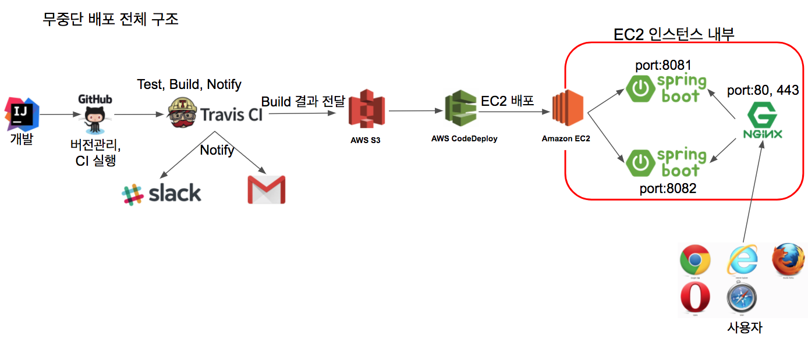

# Spring Boot 웹서비스 개발부터 배포까지  

## 개요
Spring Boot로 간단한 웹페이지 개발부터 Travis CI를 통한 자동배포까지 하는 프로젝트입니다.

## 기술요약
- AWS EC2 (Amazon linux)
- AWS RDS (Maria DB)
- AWS CodeDeploy
- AWS S3
- Nginx
- Travis CI
- Coveralls

## 서비스 배포 요약

출처: [*jojoldu님 블로그*](https://jojoldu.tistory.com/267?category=635883)

- 개발 후 Github에 `Commit`과 `Push`(`master` 브랜치 기준)를 통해서 위와 같은 Flow로 배포를 자동으로 진행하게 됩니다.
- `Nginx`의 무중단배포를 통해 jar 두개와 `Nginx` 하나로 무중단배포를 가능하게 합니다.
- `Nginx`는 reload를 통해서 새로운 jar와 연결을 맞바꾸는데 이때 1초내외로 reload가 가능하다고 합니다.

 
# Referrence
- [jojoldu님의 Springboot로 웹서비스 출시하기](https://github.com/jojoldu/springboot-webservice)

